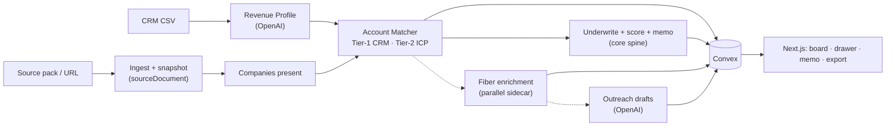

# Schrute

**Before you wire the sponsor check, see the pipeline that's already going.**

Connect your CRM, drop in an event, and Schrute identifies which of your **target accounts have confirmed presence** at that show — with cited evidence, a sponsor/attend/skip verdict, and (via the enrichment sidecar) likely outreach contacts and drafted meeting requests.

> **Honest one-liner:** Schrute connects your CRM to public event evidence, identifies which of your **target accounts have confirmed presence** at an event, scores the **sponsor / attend / side-event / skip** decision with break-even math, and turns the matched accounts into **pre-event outreach targets**.

> Built for the Orange Slice AI Growth Hackathon @ YC. Idea + POC + pitch first; the stack (OpenAI · Fiber AI · Convex · Next.js) is just how we get there.

---

## The pitch in six lines

1. Field-sales-heavy B2B teams (construction, safety, industrial) spend $20K–$50K on trade-show booths *before* knowing if their target accounts have public presence there.
2. Today that decision is made on a sponsor deck, a deadline, and a gut feel. The actual money-making prep — figuring out who's there and booking them — is done by hand in a spreadsheet, badly, if at all.
3. Schrute reads your CRM and the event's public footprint, and tells you which of *your* accounts and open deals have public evidence at that event.
4. Then it does the work: names the decision-makers, pulls verified contacts (Fiber), and drafts the pre-event meeting requests.
5. The go/no-go memo — sponsor cap, break-even meeting count — falls out for free, grounded in counted real accounts.
6. We start with construction and safety sellers because events are central, the data is messy, and the ACVs justify buying.

**The line we close on:** *Most AI sales tools help you spam more strangers. Schrute hands your reps the buyers who are already in the building.*

---

## The painful moment (the wedge)

We are not building "event intelligence for B2B." That's a category, and it's already occupied (see Vendelux below). We're building for **one specific moment**:

> A founder or sales lead just got a **$25K sponsor quote** and has **48 hours** to decide. Buy the booth? Send two reps without one? Host a dinner? Skip it?

That moment has a deadline, a dollar figure, and real uncertainty — which is exactly when someone pays for an answer. Everything in the product serves that moment and the prep that follows it.

### Who feels it

Founder / Head of Sales / VP Growth / Field Marketing lead at a B2B company selling into construction, safety, industrial ops, field service, or EHS. Best first customer:

- 10–250 employees, ACV above ~$15K
- Founder-led or sales-led GTM, has a CRM (or at least a customer CSV)
- Deciding on upcoming trade shows / association events / sponsorships
- Does **not** have a mature field-marketing analytics team
- Feels booth spend in cash, not just a brand budget

### Not for (yet)

Pure PLG/low-ACV SaaS, consumer events, recruiting events, generic networking, teams whose event goal is pure brand awareness, or anyone with no CRM and no target-account clarity.

---

## What it actually does

Three objects, one flow. The first two answer "is my pipeline here?"; the third does the work.

### 1. Revenue Profile — "who do we actually win?"
From a CRM CSV (or HubSpot), Schrute learns the company's reality: closed-won industries, buyer titles, deal-size clusters, target-account list, open-opportunity accounts, geographies, and the language of the business. This is the lens every event is matched against.

### 2. Account Match — "which of our accounts are confirmed present?" *(the core)*
Schrute ingests the event's public footprint (exhibitors, sponsors, speakers, agenda) and matches **companies confirmed present** against the Revenue Profile in two tiers:
- **Tier 1 — Known accounts:** companies *already in your CRM* — open opps, target accounts, past customers, closed-won lookalikes. Highest value, fully verifiable **company presence** (not personal attendance).
- **Tier 2 — Net-new ICP:** strong-fit companies *not* in your CRM. Your pre-qualified prospecting list.

Every match carries typed `evidence[]`: role at the event (exhibitor/sponsor/speaker), booth/session, source URL, and quote. **Public evidence proves a company is present — never that a named person will attend.**

### 3. The Worklist — "who do we talk to and what do we say?" *(the payload — enrichment sidecar)*
For each matched account, the **parallel enrichment sidecar** (Fiber) pulls likely ICP-title decision-makers and verified emails/phones, then drafts personalized pre-event meeting requests. **The core spine (match → score → memo) never blocks on enrichment.**

### Cherry on top — the Go/No-Go Memo
Now that we have a counted list, the memo is credible instead of hand-wavy:
> **Sponsor up to ~$32K.** 7 CRM accounts have public ASSP Safety 2026 speaker/sponsor evidence, including 2 open opps worth **$350K**. Break-even: **7 qualified meetings**. At a $25K quote, the sponsor case clears because the evidence shows real account presence; the WOC supplier-control event returns skip instead of pretending the same CRM is present everywhere.

---

## The 60-second demo

Fictional-but-realistic company: **SafeSite OS**, sells safety/compliance software to mid-market construction contractors.

1. Upload SafeSite's CRM CSV (closed-won + open opps + target accounts). Schrute builds the Revenue Profile live.
2. Drop in a **real** event with public speaker/sponsor evidence (ASSP Safety 2026) + the $25K quote.
3. **The wow:** in ~60s a board lights up - *"7 CRM accounts have public presence evidence at this event. 2 are open deals worth $350K."*
4. Click **PG&E** or **Rosendin** -> drawer shows the ASSP session/sponsor evidence, the matched account, and the outreach sidecar area for Fiber/OpenAI once enrichment is wired.
5. Hit **Export / Push to CRM**.
6. Run the WOC supplier-control event and show **skip**. Judge thinks: *"This is not a yes-machine; it says no when the public evidence does not support the CRM match."*

Engineer the wow: pin one real event where the buyer companies genuinely show up in public speaker/sponsor evidence, keep 5-7 undeniable Tier-1 matches, add a couple Tier-2 lookalikes, and leave visible non-matching CRM accounts. Latency reads as intelligence if we stream progress ("source evidence -> account matches -> underwriting memo").

---

## Why we win

### Positioning
| Other tools | Schrute |
| --- | --- |
| Attendee scrapers → spam strangers | Surfaces *your* accounts and pipeline, CRM-grounded |
| Event-management / discovery platforms | Pre-spend decision + the meeting worklist |
| Sales-engagement tools (operate after) | Operates before money is committed |
| Generic "AI for conferences" | Construction/safety/industrial, blunt and specific |

### "Why not Vendelux?"
[Vendelux](https://vendelux.com/) is the strongest adjacent product and proves the category is real — we don't out-database them in 24 hours, and we don't try. Our wedge is narrower and lands lower:
- **Pre-sponsorship decision moment**, not a full event-marketing platform.
- **Construction/safety/industrial first**, not broad B2B.
- **CSV-in, worklist-out in 60 seconds** for teams *before* they have event-ops maturity — Vendelux is Bloomberg for mature field-marketing teams; we're the underwriting memo + worklist a founder wants before wiring booth money.
- We end in **contacts + drafted outreach + CRM tasks**, not a dashboard.

### Source integrity (this is what keeps it from being a fancy summary generator)
- Every evidence card links to a source document; every extracted claim carries a quote.
- The model **cannot invent attendee lists** — if a source doesn't contain a fact, it returns `unknown`, not a guess.
- **Confidence is separate from fit.** A Tier-1 open opp confirmed as an exhibitor is high-fit *and* high-confidence; an ICP-similar company seen only in a 2019 recap is high-fit, low-confidence.
- "Ask for more data" is a valid recommendation. Missing evidence is shown, not hidden.
- The scoring is deterministic and inspectable in the UI — we can defend any number live.

### Don't ship fake-ahh claims
**Never say:** "we know who will attend" when the source doesn't show it · "AI predicts your event ROI" with hidden assumptions · "connect your CRM" if the demo only takes a CSV · "works for every industry" before one vertical works · "autonomous GTM agent."
**Do say:** "we turn public event evidence + your CRM into confirmed **account presence** at the event" · "we show the break-even before you buy the booth" · "we separate buyer fit from evidence confidence" · "we say skip when the math doesn't work."

---

## Development setup

```bash
git clone <repo>
cd YC-GTM-Hackathon
npm install
cp .env.example .env.local   # add OPENAI_API_KEY, FIBER_API_KEY
npx convex dev               # terminal 1 — Convex backend
npm run dev                  # terminal 2 — Next.js
```

**Build against mocks immediately:** UI mocks live in `lib/mocks.ts`; the headless real-data spine demo lives in `convex/lib/demoSeed.ts` plus `data/source_packs/`. **Contract queries:** `convex/contracts.ts`. **AI schemas:** `lib/aiSchemas.ts`. **Company resolution seam:** `lib/resolveCompany.ts`.

| Seam | Location | Consumer |
| --- | --- | --- |
| Schema + types + mocks | `convex/schema.ts`, `lib/types.ts`, `lib/mocks.ts` | Everyone |
| `accountMatch` row shape | schema + mocks | Nehal (sidecar) |
| `resolveCompany()` | `lib/resolveCompany.ts` | Nehal (optional Fiber swap) |
| Underwriting assumption *values* | `event.assumptions` / Nehal → Kathan | Nehal inputs, Kathan logic |
| Reactive queries + `jobs` enum | `convex/contracts.ts`, `lib/types.ts` | Darren |
| Typed `evidence[]` + AI schemas | `lib/aiSchemas.ts` | Shared |

---

## The economics (grounded, not guessed)

The break-even is deterministic so we can debug it live. The key move vs. a typical "AI predicts ROI" tool: **the expected-meetings number is anchored to *counted* matched accounts, not an LLM's density guess.**

```
totalEventCost            = sponsorCost + travelCost + repTimeCost
revenuePerQualifiedMeeting = avgDealSize × meetingToOppRate × winRate × riskDiscount
requiredQualifiedMeetings  = ceil(totalEventCost / revenuePerQualifiedMeeting)
sponsorCap                 = max(0, matchedPipelineValue × captureRate − travelCost − repTimeCost)
```

`matchedPipelineValue` comes from the Tier-1 open opps we actually found at the event — so the cap rests on real accounts, not vibes. The memo makes it human: *"At $25K all-in, this needs 9 qualified meetings to break even. You have 6 open deals already on the floor. Skip the booth, send two reps, host a dinner."*

---

## Architecture (enough to prove it's real)

Nobody scores us on code elegance — they score the idea, the POC, and the pitch. So this is the minimum that proves it's buildable and lets three people move without blocking.

### Stack
| Layer | Tool | Role |
| --- | --- | --- |
| Data engine | **Fiber AI** | Company resolution → ICP-title decision-makers → **verified** emails/phones. The muscle that turns "company present" into "buyer reachable." |
| Intelligence | **OpenAI** (structured outputs) | Parse messy event pages → structured companies; fuzzy CRM matching; ICP inference; outreach + memo generation. |
| Backend/state | **Convex** | Schema, reactive queries (the board lights up live), actions that orchestrate OpenAI + Fiber with streamed progress, file storage for CSV/PDF. |
| Frontend | **Next.js / React** | Upload, board, drawer, memo, export. |
| Ingestion | URL fetch + CSV/PDF parse | Exhibitor/sponsor pages are public HTML; no fragile browser automation for MVP. |

### Flow


### The data contract (frozen first, so nobody blocks)
Kathan locks the Convex schema + TypeScript types in the first 60–90 min. After that the frontend builds against typed mock data, the engines fill the same tables, everyone runs parallel. Core tables: `revenueProfile`, `crmAccount`, `event`, **`sourceDocument`**, **`eventFact`**, `eventCompany`, `accountMatch` (seam to enrichment sidecar), `eventScore`, `decisionMemo`, `contact`, `outreachDraft`, `jobs`. Every claim carries typed `evidence[]` → a `sourceDocument`. See `lib/types.ts`, `lib/mocks.ts`, `lib/aiSchemas.ts`.

---

## How we split the work

The only hard gate is the schema, and it ships first. The **matching + underwriting brain** and the **enrichment sidecar** split cleanly along the `accountMatch` table.

### Kathan — the brain (matching, underwriting, orchestration, pitch)
- The Convex schema + types (**the contract — ship first**).
- Revenue Profile builder (OpenAI clustering → ICP lens).
- **Account Matcher** — Tier-1 entity matching + Tier-2 ICP fit, evidence attachment, ranking. The core IP.
- **Underwriting / decision engine** — break-even formula, thresholds (sponsor/attend/side-event/ask-for-data/skip), score interface, fallback default assumptions. **The wedge.**
- Go/No-Go memo narrative (Schrute voice, citation-constrained).
- Core orchestration spine: `ingest → extract → match → score → memo` (+ parallel sidecar hooks).
- The demo narrative, the "why this wins" argument, and picking the real event so matches genuinely land.

### Nehal — activation sidecar + underwriting inputs
Consumes `accountMatch` rows and provides **inputs** (not decision logic) for the economics engine:
- **Fiber integration** — company resolution (optional swap behind `resolveCompany()`) + decision-maker pull + verified contacts → `contact` rows.
- **Outreach engine** — OpenAI prompts + Convex action: `(matched account + event context)` → meeting requests.
- **Underwriting assumption inputs** — win rate, meeting→opp, capture rate, cost estimates, buyer objections. Kathan wires values into `underwrite.ts`; defaults cover the gap if late.
- **Competitive + buyer positioning** — "why not Vendelux," buyer objections, validation conversations.

Clean seam: develop against `lib/mocks.ts` `mockAccountMatchesForEnrichment` from hour 1; swap to live matcher output when ready. **Enrichment never blocks score + memo.**

### Darren — the product surface (Next.js)
- App shell, CRM upload flow, Revenue Profile reveal.
- The **matched-account board** (ranked, evidence chips) — the centerpiece.
- The **account drawer** (contacts, verified-email badges, outreach drafts, edit/copy).
- Memo view + export / push-to-CRM action.
- Loading / empty / failed states wired to Convex reactive queries (the "board lights up" moment).
- Mock-data mode so the UI is demo-ready before the backend is fully live.

### Rough timeline
- **H0–2:** Kathan freezes schema + contracts; Darren scaffolds app + mock board; Nehal stubs the Fiber + outreach engine against mock matches and locks the demo company + real event.
- **H2–8:** Kathan: CSV→profile + matcher on one event. Nehal: live Fiber enrichment + first real outreach drafts + break-even. Darren: upload + board + memo from mock JSON.
- **H8–16:** wire UI to live Convex; matcher Tier-2 + scoring; outreach polish; drawer + progress states.
- **H16–22:** end-to-end fixes, explainable scores, fallback seed data, UI polish, export button.
- **H22–24:** rehearse the demo 5×, time the pitch, cut anything off-wedge, prep answers on data accuracy / Vendelux / pricing.

---

## Where it goes next (the expansion, not the wedge)

Once we know which events hold your pipeline, the obvious platform move:

- **Portfolio Planner (the reframed trip idea).** Not "save on flights" — that's a vitamin. The real version is **pipeline concentration**: *"Your $350K of present pipeline clusters across 3 Q3 shows in the Midwest — send your two best reps to those back-to-back, skip the other 7."* Travel efficiency is the side effect; focusing reps where pipeline actually is, is the point. Cheap to build *on top of* the matcher (it's a sort/cluster over matched value + dates + geography), worthless without it. **V2, never on the hackathon critical path** — at most a static mock screen if Sunday has spare hours.
- HubSpot/Salesforce write-back and live sync.
- Event discovery (suggest shows your pipeline clusters at, that you're not already considering).
- Post-event feedback loop: matched accounts → actual meetings → actual pipeline. That outcome graph is the long-term moat and makes the scoring vertical-specific over time.

---

## Pricing (tight, and now provable)

Value is attributable (meetings booked, pipeline influenced), so it anchors to pipeline, not "avoided spend."

| Plan | Price | Buyer |
| --- | ---: | --- |
| Per-event report + worklist | $500–$1.5K / event | Team deciding on one show |
| Growth | $1K–$3K / mo | Active event calendar (5–20 events/quarter) |
| Enterprise | $10K–$50K / yr | Multi-region field marketing + CRM integration |

**Distribution:** free "which of my accounts have evidence at [event]?" scorecards as a lead magnet, founder-led outbound to companies already making event spend decisions, field-marketing/RevOps communities.

---

## Product voice

Blunt, funny, evidence-backed — but the evidence is a real account, not a guess.
- "2 open deals have public presence evidence at this event. Go book them."
- "High logo density, only 2 are yours. Send one rep, skip the booth."
- "PG&E is on the ASSP program and you have a $140K deal open. Why are you reading this?"
- "Net-new: 9 ICP-fit exhibitors not in your CRM. That's your prospecting list, pre-qualified."
- "False. This event is popular, not profitable. Skip unless your goal is competitor-watching."

---

## North Star

Teams stop walking into events blind and hoping. They walk in with a worklist: *these are my accounts, this is the human, this is the ask.* Schrute wins when "we have a booth at X" turns, automatically, into "here are the right meetings to book before we land."

---

### Research anchors
- [Orange Slice Hackathon @ YC](https://events.ycombinator.com/OrangeSliceHackathon) · [Orange Slice](https://www.orangeslice.ai/) (host thesis: prompt → pipeline → action)
- [Fiber AI](https://www.ycombinator.com/companies/fiber-ai) — company/person/contact data APIs (the enrichment engine)
- [Vendelux](https://vendelux.com/) — the adjacent incumbent we position against
- [World of Concrete](https://www.worldofconcrete.com/) · [ASSP Safety](https://safety.assp.org/) — demo events with public exhibitor/sponsor surface area
- Convex [actions](https://docs.convex.dev/functions/actions) · [file storage](https://docs.convex.dev/file-storage) · [scheduling](https://docs.convex.dev/scheduling/scheduled-functions) · OpenAI [structured outputs](https://platform.openai.com/docs/guides/structured-outputs)
