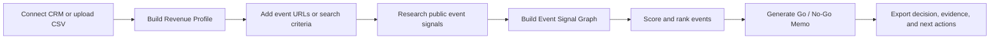
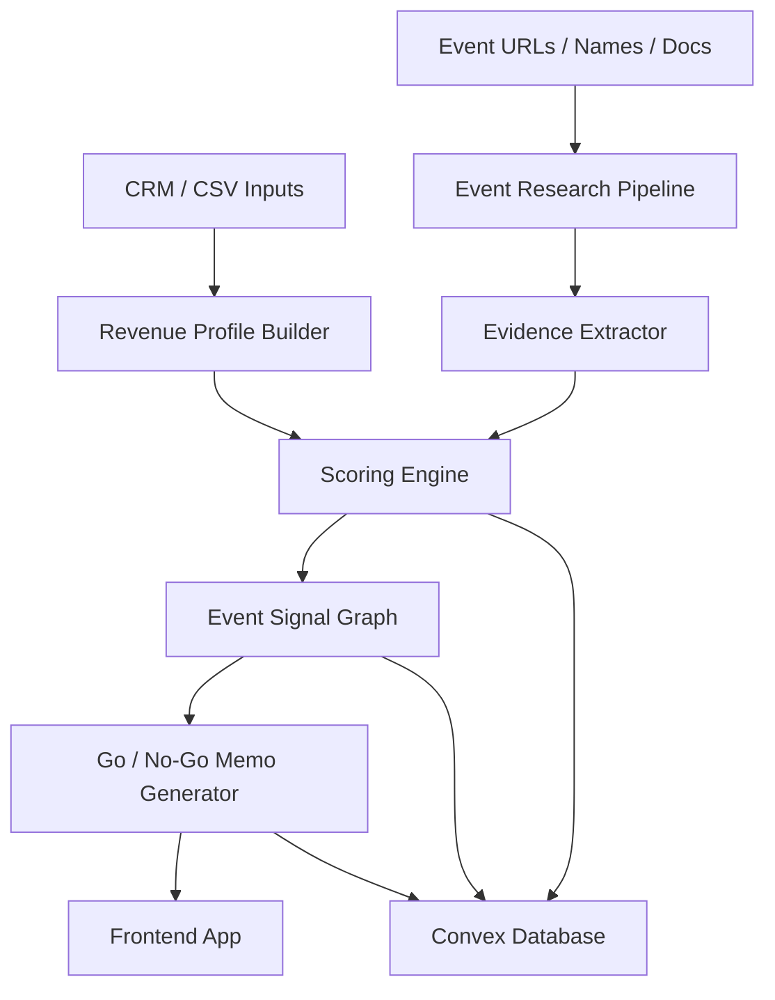
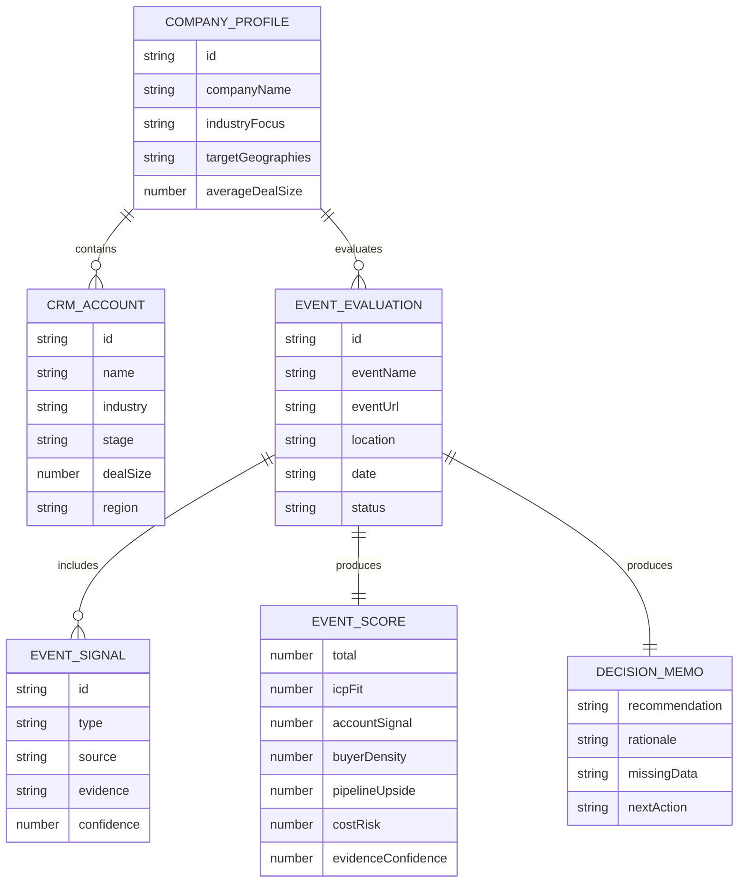

# Schrute AI

## One-Sentence Vision

Schrute AI is an event intelligence engine for B2B teams in "boring" industries that tells them which conferences, trade shows, and field events are worth attending, sponsoring, or skipping before they spend the money.

## Problem

B2B companies with expensive field-sales motions spend serious money on events, but most event decisions are still made with weak evidence.

Teams ask:

- Should we attend this event?
- Should we sponsor it or just send reps?
- Will our actual buyers be there?
- Is this a pipeline event or a brand/FOMO event?
- How much pipeline would justify the spend?
- What proof do we have beyond sponsor decks and anecdotes?

The pain is strongest for companies where one in-person meeting can create meaningful pipeline: construction tech, industrial SaaS, oil and gas, manufacturing, logistics, energy, safety, insurance, agriculture, and other field-heavy B2B categories.

### Who Experiences This Pain

| User | Pain |
| --- | --- |
| Founder / CEO | Needs to decide where to spend scarce GTM budget. |
| VP Sales / Head of Growth | Needs qualified pipeline, not booth traffic. |
| Field Marketing | Needs to justify event spend and prioritize the calendar. |
| RevOps | Needs a repeatable event scoring and ROI model. |
| Account Executives | Need to know which events are worth travel and preparation time. |

### Why Existing Solutions Fall Short

| Existing approach | Why it is not enough |
| --- | --- |
| Spreadsheets | Require known events and manual research; do not infer buyer fit from CRM data. |
| Sponsor decks | Optimized to sell booths, not objectively assess ROI. |
| Event attendee scraping tools | Useful only when attendee data exists and usually focus on outreach, not investment decisions. |
| Sales engagement tools | Help send messages after an event is chosen; they do not answer whether the event deserves budget. |
| Marketing attribution tools | Mostly measure after the fact; they do not help teams make the pre-event go/no-go call. |

## Why Now?

### Market Shifts

- Cold outbound is becoming more saturated, less trusted, and more dependent on warm context.
- Many B2B categories still rely on trust-heavy buying motions where in-person meetings matter.
- Companies are under more pressure to prove event ROI as travel, booths, sponsorships, and rep time become expensive.
- "Boring" industries are being digitized, but their GTM motions still run through conferences, trade shows, associations, and regional meetups.

### AI Shifts

- LLMs can turn unstructured event pages, sponsor lists, agendas, PDFs, recaps, and social posts into structured signals.
- AI agents can research public sources faster than a marketing coordinator or sales rep.
- CRM data can be mined for patterns that define what a valuable event looks like for a specific business.
- Event quality can now be scored with an evidence model instead of pure intuition.

### Timing Bet

The current wave of AI GTM tools is focused heavily on email, LinkedIn, enrichment, and outbound automation. Schrute AI bets that the next valuable GTM workflow is not sending more cold messages, but deciding where high-context human relationships are worth creating.

## Target User / ICP

### Primary ICP

B2B companies with expensive field-sales motions where events are a meaningful source of pipeline.

Best-fit characteristics:

- Mid-market or enterprise ACV, roughly `$20K-$250K+`
- Sales cycles that benefit from trust, context, and in-person relationship building
- Existing or planned event budget
- CRM with closed-won accounts, open opportunities, and customer history
- Buyers concentrated in industry associations, trade shows, regional conferences, or compliance-driven communities

### Initial Wedge

Start with companies selling into construction, industrial, oil and gas, safety, manufacturing, logistics, energy, or field-service markets.

Reasoning:

- These industries are event-heavy.
- Their events are often under-instrumented.
- Buyer trust is still built in person.
- Existing AI GTM tooling under-serves them.
- The user's domain knowledge gives the team a credible demo and sharper intuition.

### Not For

Schrute AI is not initially for:

- Pure PLG SaaS teams with low ACV and no field-sales motion
- Consumer events
- Recruiting events
- Generic networking apps
- Teams whose event strategy is only brand awareness with no pipeline expectation
- Companies with no CRM, no target market clarity, and no willingness to define event goals

## Core Insight

Most events do not publish clean attendee lists. That is not a blocker; it is the product opportunity.

The non-obvious belief:

> The attendee list is only one signal. The real product is an Event Signal Graph that uses public proxy evidence to decide whether an event is likely to contain a company's buyers.

Schrute AI works even when attendee lists are hidden by combining:

- Direct attendee signals when available
- Sponsor, exhibitor, speaker, and partner signals
- Historical event evidence
- LinkedIn and social intent signals
- Agenda and topic relevance
- CRM similarity patterns
- Buyer persona and industry fit
- Cost and pipeline break-even math

The product does not need perfect data. It needs to expose confidence, evidence, and decision thresholds clearly.

## Product Overview

Schrute AI answers one primary question:

> Before we spend `$30K` and send the team, is this event worth betting on?

It does this through three core product objects.

### 1. Revenue Profile

The Revenue Profile answers: "Who do we actually win?"

Inputs:

- CRM export or HubSpot connection
- Closed-won accounts
- Open pipeline
- Target account list
- Past customer list
- Competitor list
- Deal size
- Geography
- Industry
- Buyer titles
- Deal notes, if available

Outputs:

- Best-fit industries
- Buyer personas
- Deal-size clusters
- High-value geographies
- Buying triggers
- Keywords and industry language
- Closed-won lookalike patterns
- Suggested event goal, such as qualified meetings, expansion conversations, partner discovery, or target account penetration

### 2. Event Signal Graph

The Event Signal Graph answers: "What public evidence suggests our buyers are here?"

Signal categories:

| Signal type | Examples | Value |
| --- | --- | --- |
| Direct attendee signals | Public Luma lists, Eventbrite pages, uploaded lists, conference apps, sponsor portals, LinkedIn event pages | Strongest evidence, but often unavailable |
| Company-presence signals | Sponsors, exhibitors, speakers, agenda hosts, advisory boards, booth directories, workshop leaders, association members | Strong proxy for market participation |
| Historical signals | Past recaps, old sponsor PDFs, "attendees included" pages, event photos, YouTube panels, press releases, previous exhibitor directories | Shows recurring audience and buyer ecosystem |
| Social intent signals | LinkedIn posts, "see you at..." posts, company announcements, speaker promotions, booth announcements, hashtags | Indicates live or recent participation |
| ICP proxy signals | Agenda topics, buyer titles, certifications, compliance themes, region, association niche, vendor ecosystem, industry terminology | Helps infer buyer density when direct data is missing |

Example output:

> We found 47 company-presence signals, 12 direct attendee signals, 8 strong ICP proxy signals, and 6 historical signals. Confidence: medium-high.

### 3. Go / No-Go Memo

The memo answers: "What should we do?"

Possible recommendations:

- Attend
- Skip
- Maybe, request more data
- Send reps only
- Sponsor
- Do not sponsor
- Request quote, but cap spend
- Host a dinner instead of buying a booth
- Monitor competitor presence

Example:

> Attend. Do not sponsor unless booth cost is under `$14K`. We found strong safety/compliance buyer density, 9 ICP-matched sponsors, 4 closed-won lookalike companies, and medium confidence that operations leaders attend. Required success threshold: 6 qualified meetings.

## User Journey

### Step 1: Build Revenue Profile

The user connects HubSpot or uploads a CSV.

The system analyzes:

- Closed-won deals
- Open opportunities
- Past customers
- Target accounts
- Competitors
- Deal size and regions

The first "wow" moment should be:

> Schrute AI inferred what a good event looks like for this company.

### Step 2: Select or Discover Events

MVP should compare a shortlist rather than attempt fully open-ended discovery.

The user can:

- Paste 3-5 event URLs
- Enter event names
- Upload a candidate event list
- Provide a target geography and event category

Tradeoff:

- Shortlist comparison is more reliable for a hackathon demo.
- Full event discovery is more magical but harder to make trustworthy quickly.

### Step 3: Research Event Signals

The system gathers or ingests:

- Event homepage
- Agenda
- Sponsors
- Exhibitors
- Speaker list
- Partner logos
- Past event pages
- Recaps
- PDFs
- Public social posts, if available

### Step 4: Score Events

Each event receives a Schrute Score and sub-scores.

Suggested scoring model:

| Component | Weight | Description |
| --- | ---: | --- |
| ICP Fit | 30 | Does the event's language, agenda, industry, region, and roles match the Revenue Profile? |
| Account Signal | 25 | Are sponsors, exhibitors, speakers, or visible companies similar to target accounts or closed-won customers? |
| Buyer Density | 15 | Is there evidence of decision-makers and operators, not only vendors selling to each other? |
| Pipeline Upside | 15 | Does the expected value justify rep time and likely cost? |
| Cost Risk | 10 | Are sponsorship, booth, travel, and time costs likely to exceed reasonable break-even thresholds? |
| Evidence Confidence | 5 | How complete and reliable is the available evidence? |

Important: confidence is not the same as fit. A high-fit event with low evidence should be marked as promising but uncertain.

### Step 5: Receive Go / No-Go Memo

The memo should include:

- Recommendation
- Expected qualified pipeline range
- Event score
- Confidence
- Evidence summary
- Missing data
- Sponsorship threshold
- Rep attendance recommendation
- Required success criteria
- Suggested next action

## Core Features

### MVP

Build these first.

- [ ] CRM CSV upload with sample schema
- [ ] Revenue Profile extraction from closed-won and target accounts
- [ ] Event URL or pasted event-content ingestion
- [ ] Event Signal Graph with evidence categories
- [ ] Event ranking board
- [ ] Schrute Score and sub-scores
- [ ] Go / No-Go Memo
- [ ] Cost threshold and break-even estimate
- [ ] Blunt but evidence-backed product voice
- [ ] Demo dataset for construction/safety or industrial B2B

MVP should optimize for a crisp demo, not full automation.

### V2

- [ ] HubSpot integration
- [ ] Salesforce integration
- [ ] Automatic event discovery by industry, geography, and persona
- [ ] Sponsor/exhibitor PDF parsing
- [ ] Historical event comparison
- [ ] LinkedIn and social signal ingestion, where allowed
- [ ] Team collaboration and event approval workflow
- [ ] Post-decision action plan: reps, meeting goals, pre-event outreach, and sponsor quote questions
- [ ] Past event performance tracking

### Future Ideas

- [ ] Event portfolio planner by quarter
- [ ] Budget allocation optimizer
- [ ] Competitor event monitoring
- [ ] Event ROI feedback loop from CRM
- [ ] Quote negotiation assistant
- [ ] Booth vs dinner vs private meeting recommendation
- [ ] Territory-specific event scouting
- [ ] Association and community intelligence
- [ ] Automated meeting booking only after event selection is complete

## Differentiation

### Positioning

Schrute AI is not an attendee scraper or cold outreach tool. It is an event investment decision engine.

| Other products | Schrute AI |
| --- | --- |
| Find people attending an event | Decide whether the event deserves budget |
| Generate outreach | Generate a go/no-go revenue memo |
| Depend on attendee lists | Works with proxy evidence when attendee lists are hidden |
| Optimize messaging | Optimize event selection and spend |
| Operate after event choice | Operates before money is committed |
| Focus on generic SaaS outbound | Focuses on field-sales-heavy B2B and boring industries |

### Why Users Choose Us

- We help avoid bad event spend.
- We give an evidence-backed recommendation, not just raw research.
- We connect event decisions to CRM reality.
- We work when attendee lists are unavailable.
- We quantify the threshold for whether sponsorship is justified.
- We focus on industries where events actually matter.

### Competitive Threats

Potential competitors or substitutes:

- Clay-style workflows
- Event attendee enrichment tools
- Sales engagement platforms
- Field marketing spreadsheets
- Internal RevOps analysis
- Manual research agencies

Defensibility depends on:

- Strong event signal taxonomy
- CRM-to-event matching logic
- Historical event outcomes
- Proprietary feedback loop from event decisions to pipeline outcomes
- Vertical-specific scoring models

## Technical Architecture

### High-Level Components

### Suggested Stack

| Layer | Tool | Purpose |
| --- | --- | --- |
| Frontend | React / Next.js | Demo app and event ranking UI |
| Backend/state | Convex | Store users, profiles, events, evidence, scores, and memos |
| AI | OpenAI API | Extraction, classification, scoring explanations, memo generation |
| Integrations | HubSpot first | CRM connection and closed-won analysis |
| Ingestion | URL fetch, pasted content, CSV upload | Practical MVP data collection |
| Optional | Browser/search APIs | Event discovery and public signal collection |

### Data Flow

1. User uploads CRM CSV or connects CRM.
2. Revenue Profile Builder extracts ICP patterns.
3. User enters candidate events or search criteria.
4. Event Research Pipeline collects structured and unstructured public evidence.
5. Evidence Extractor normalizes signals into categories.
6. Scoring Engine compares event signals against the Revenue Profile.
7. Memo Generator creates an opinionated recommendation with evidence and thresholds.
8. Frontend displays event ranking, evidence graph, and go/no-go memo.

### AI Systems

Use AI for:

- CRM pattern extraction
- Event page summarization
- Sponsor/exhibitor/speaker extraction
- Agenda topic classification
- Buyer persona inference
- Signal confidence assessment
- Scoring explanation
- Go/no-go memo generation

Do not use AI as a black box for the final score without exposing evidence. The score should be explainable and adjustable.

### Key Data Objects

## Major Product Decisions and Tradeoffs

### Decision: Start With Event Due Diligence, Not Full Discovery

Reasoning:

- Comparing 3-5 candidate events is easier to demonstrate and verify.
- Users often already have a shortlist.
- It avoids weak "we found every event on the internet" claims.

Tradeoff:

- Full event discovery feels more magical.
- It requires better search, deduping, source ranking, and freshness handling.

### Decision: Make Attendee Lists Optional

Reasoning:

- Many valuable B2B events do not publish attendee lists.
- A dependency on attendee lists would make the product fragile and similar to outreach tools.
- Proxy signals are the product's real wedge.

Tradeoff:

- Recommendations must show confidence and evidence gaps clearly.
- Some events will remain uncertain.

### Decision: Use a Blunt Product Voice

Reasoning:

- The Schrute brand should be memorable.
- Event decisions need conviction.
- Users want a recommendation, not a neutral research dump.

Tradeoff:

- The voice must never hide uncertainty.
- Humor should support the decision, not make the product feel unserious.

Example:

> False. This event is popular, not profitable. Skip unless your goal is competitor monitoring.

## Success Metrics

### Product Metrics

| Metric | Why it matters |
| --- | --- |
| Events evaluated per account | Shows repeated use. |
| Percentage of recommendations acted on | Measures trust. |
| Time saved per event decision | Quantifies operational value. |
| Bad event spend avoided | Clear ROI story. |
| Event-to-pipeline conversion | Long-term proof that scoring works. |
| Memo share/export rate | Indicates usefulness for internal buy-in. |

### GTM Metrics

| Metric | Why it matters |
| --- | --- |
| Number of qualified design partners | Validates ICP. |
| Willingness to pay for event report | Tests monetization. |
| CRM integrations connected | Shows real workflow adoption. |
| Events scored before next conference season | Captures timing urgency. |

### Hackathon Demo Metrics

- Can a judge understand the product in 30 seconds?
- Does the demo clearly show a before/after improvement over spreadsheets?
- Does the app produce an opinionated decision, not just a summary?
- Does it fit the GTM application judging criteria?
- Does it use OpenAI in a meaningfully intelligent way?
- Does the team have a credible path beyond the demo?

## Go-To-Market Strategy

### Initial Wedge

Target field-sales-heavy B2B companies in construction, safety, industrial, oil and gas, manufacturing, logistics, and energy.

Positioning:

> Stop guessing which events create pipeline.

Alternate:

> Before you buy the booth, ask Schrute.

### Early Customers

Best early users:

- B2B startups selling into construction or industrial markets
- Founder-led sales teams attending trade shows for the first time
- Field marketing teams with 10-50 events per year
- RevOps teams trying to rationalize event spend
- Sales leaders with target account lists and regional territories

### Distribution

Potential channels:

- Founder-led outbound to companies sponsoring or attending trade shows
- LinkedIn content around "event ROI teardown" reports
- Free event scorecards for upcoming industry conferences
- Partnerships with GTM consultants serving industrial/construction SaaS
- Communities for field marketing and RevOps
- Conference-specific landing pages such as "Should you sponsor World of Concrete?"

### Pricing Hypotheses

| Plan | Price hypothesis | Buyer |
| --- | ---: | --- |
| Event Report | `$250-$1K` per report | Teams testing one event |
| Starter | `$299/mo` | Small teams comparing a few events |
| Growth | `$1K-$2K/mo` | Teams with active event calendars |
| Enterprise | `$10K-$50K/yr` | Multi-region teams with CRM integrations and approval workflows |

Pricing should anchor to avoided spend and pipeline upside.

Example ROI:

- If Schrute AI prevents one bad `$30K` event, it pays for itself.
- If it helps identify one event that creates an `$80K` deal, it pays for itself many times over.

## Open Questions & Assumptions

### Assumptions

These are not yet validated facts.

- Event selection is painful enough that teams will pay before ROI attribution is perfect.
- "Boring industry" buyers are under-served by current AI GTM tooling.
- Public proxy signals can predict event quality well enough to support decisions.
- Field marketing and sales leaders will trust AI recommendations if evidence is transparent.
- A shortlist-comparison workflow is valuable before full event discovery exists.
- Construction/safety/industrial is a strong enough initial demo wedge.

### Questions We Need to Answer

- Who owns final event budget in the initial ICP: Field Marketing, Sales, Growth, or founder?
- Do buyers want event discovery, event comparison, or sponsorship due diligence first?
- What CRM fields are reliably available across early customers?
- How accurate can public proxy signals be without attendee data?
- Which events have enough public evidence for a strong demo?
- What is the minimum evidence threshold for a trustworthy recommendation?
- How should we estimate sponsorship cost when pricing is quote-based?
- Should the product produce expected pipeline in dollars, qualified meetings, or both?
- How much of the score should be deterministic vs AI-generated?
- What integrations matter first: HubSpot, Salesforce, Clay, Attio, or CSV?

## Roadmap

### Next Week

Goal: Build a convincing hackathon-grade MVP.

- [ ] Create demo CRM dataset for a construction/safety or industrial SaaS company
- [ ] Define CSV schema
- [ ] Build Revenue Profile extraction
- [ ] Select 3-5 real or realistic events for comparison
- [ ] Build event ingestion from pasted text and URLs
- [ ] Extract evidence into signal categories
- [ ] Implement first Schrute Score model
- [ ] Build ranked event board
- [ ] Generate Go / No-Go Memo
- [ ] Prepare demo script and pitch
- [ ] Validate with at least 3 people who have attended or budgeted B2B events

### Next Month

Goal: Turn the MVP into a design-partner product.

- [ ] Add HubSpot integration
- [ ] Improve evidence extraction and source citations
- [ ] Add quote-based cost assumptions and break-even calculator
- [ ] Add event report export
- [ ] Add team notes and decision status
- [ ] Test with 5-10 design partners
- [ ] Compare recommendations against past event outcomes where possible
- [ ] Build first vertical-specific scoring model for construction/industrial

### Next Quarter

Goal: Prove repeatable value and expand from event comparison to event planning.

- [ ] Add Salesforce integration
- [ ] Add automatic event discovery
- [ ] Add historical event performance tracking
- [ ] Add event portfolio planning by quarter
- [ ] Add CRM feedback loop from event outcomes to future scoring
- [ ] Launch paid pilot
- [ ] Build case studies around avoided spend or pipeline created
- [ ] Decide whether to stay vertical-specific or expand across field-sales-heavy B2B

## Team Roles

| Role | Owner |
| --- | --- |
| GTM engineer | Own scoring logic, business narrative, demo dataset, pitch, customer validation, and event decision framework. |
| Technical teammate 1 | Own frontend, Convex schema, upload flow, ranking UI, and memo UI. |
| Technical teammate 2 | Own OpenAI extraction/scoring pipeline, event research ingestion, evidence graph, and structured JSON outputs. |

## Hackathon Focus

The demo should make one thing obvious:

> Schrute AI turns messy CRM data and messy public event evidence into a clear revenue decision.

Avoid building a generic event outreach tool. Another team is already pursuing event-based cold outreach. Our product should sit one step earlier and one level higher: event budget intelligence.

### Suggested Demo Script

1. "Everyone in SF goes to events. Some are amazing. Some are a waste of time."
2. "Now imagine you are a B2B team spending `$30K` on a booth, flights, hotels, and rep time."
3. "Today, that decision is made with sponsor decks, vibes, and spreadsheets."
4. "Schrute AI connects to your CRM, learns who you actually win, researches event signals, and tells you whether the event is worth betting on."
5. Show Revenue Profile.
6. Show 3 event comparisons.
7. Open the Go / No-Go Memo.
8. End with: "Most AI sales tools help you spam more people. Schrute AI helps field-sales teams decide where human relationships are actually worth creating."

## Product Voice

Schrute AI should be blunt, funny, and evidence-backed.

Good:

- "Attend. Do not sponsor."
- "False. This event is popular, not profitable."
- "Request quote, but cap spend at `$12K`."
- "High logo density, weak buyer density."
- "This is a relationship event, not a pipeline event."

Bad:

- Generic summaries
- Unexplained scores
- Cute jokes that weaken trust
- Confident recommendations without evidence
- Pretending an attendee list exists when it does not

## North Star

Schrute AI wins if teams stop saying:

> "Should we go because everyone else is going?"

And start saying:

> "What does the evidence say, and what would make this event worth the spend?"
